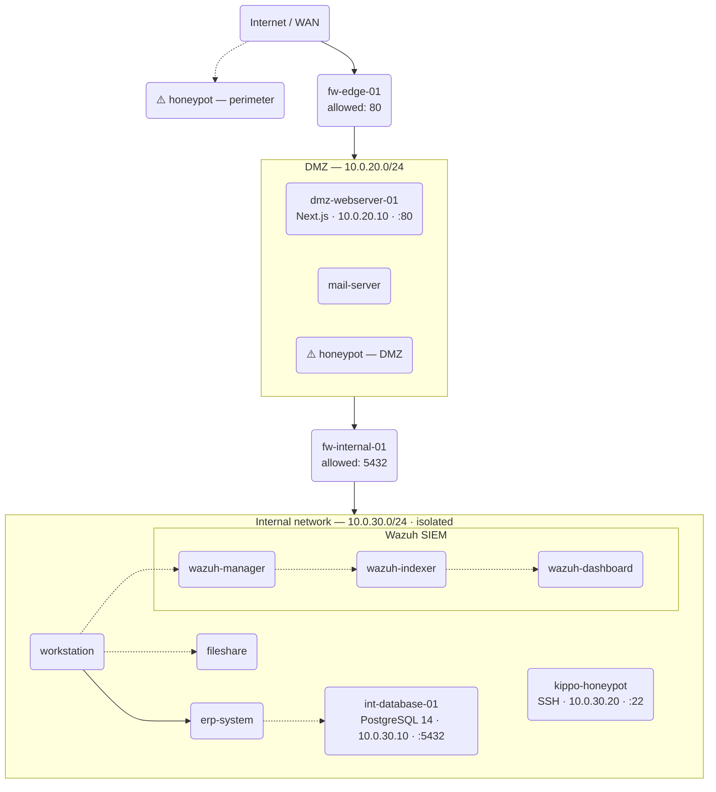

# OopsNet — Honeypot Project

OopsNet is a specialized network simulation environment designed as a robust foundation for cybersecurity research and honeypot deployment. The project emphasizes a **multi-tiered defense-in-depth architecture**, isolating services across strictly controlled Docker subnets.

## Core Architecture Overview

The infrastructure simulates a professional enterprise environment with segmented security zones and dual-firewall enforcement:



### 1. External Zone (10.0.10.x)
Represents the untrusted public internet. All traffic originating from here is strictly filtered by the Edge Firewall before reaching any services.

### 2. Edge Firewall & DMZ (10.0.20.x)
The **Edge Firewall (`fw-edge-01`)** acts as the primary gateway. It utilizes `iptables` to strictly permit only HTTP (Port 80) traffic into the DMZ.
- **NAT Redirection**: Traffic hitting the host on port 8000 is NAT-forwarded through the Edge Firewall directly to the Web Server.
- **Isolation**: Services in the DMZ cannot bypass the internal firewall to reach protected assets directly.

### 3. Internal Firewall & Private Network (10.0.30.x)
The **Internal Firewall (`fw-internal-01`)** represents the second line of defense. It enforces a "Default Drop" policy, only permitting the Web Server to communicate with the database via port 5432 (PostgreSQL).
- **Hardened Routing**: The internal network is unreachable from the external zone.
- **Simulation Target**: This zone holds the sensitive data that future honeypots will be designed to protect or simulate.

## Infrastructure Automation

The environment is managed via automated shell scripts to ensure consistent state and security validation:

- **`run.sh`**: The master deployment script. It triggers a deep cleanup followed by a full stack re-orchestration.
- **`scripts/cleanup-docker.sh`**: Performs an absolute flush of the Docker engine (containers, networks, and volumes) to prevent any configuration drift.
- **`scripts/network_check-docker.sh`**: An automated **Security Audit** script that runs immediately after deployment. It attempts various unauthorized access vectors to confirm that the dual-firewall topology is functioning correctly.

## Quick Start

Ensure you have **Docker** and **Docker Compose** installed.

```bash
# Copy example environment file to active .env
cp .env.example .env

# Set execute permissions
chmod +x run.sh scripts/*.sh

# Initialize the global infrastructure and run security audit
./run.sh
```

- **Access Point**: The DMZ WebApp (simulated service) is reachable at `http://localhost:8000`.

## Testing the Honeypot (Kippo)

To test the Kippo honeypot located in the internal network (`10.0.30.20`), use the provided testing script:

```bash
chmod +x scripts/test-kippo.sh
./scripts/test-kippo.sh
```

Alternatively, you can manually connect from the internal firewall:

```bash
# Connect with required legacy SSH algorithms
docker exec -it fw-internal-01 ssh -o KexAlgorithms=+diffie-hellman-group1-sha1 -o HostKeyAlgorithms=+ssh-rsa -o Ciphers=+aes128-cbc -o StrictHostKeyChecking=no root@10.0.30.20

# View logs on the honeypot container
docker exec -it int-honeypot-01 cat log/kippo.log
```

## Ongoing Roadmap
With **Kippo** now integrated into the Internal Network, the foundation for active deception is established. Future expansion includes:
- **Dionaea**: Deployment in the DMZ for multiprotocol capture.
- **Wazuh Integration**: Centralizing alerts from Kippo and Dionaea into the SIEM dashboard.

---
*Disclaimer: This is a simulated environment intended for cybersecurity research and demonstration purposes.*
