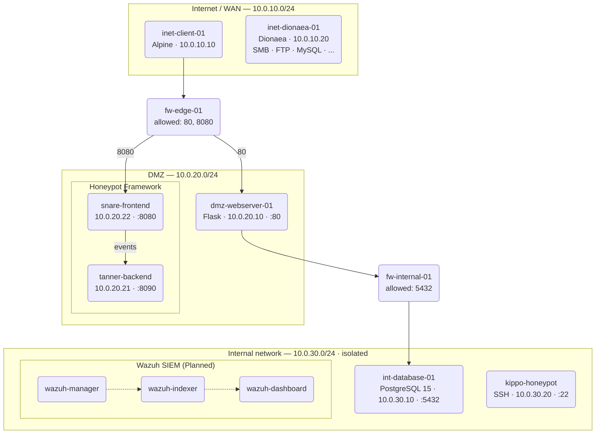

# OopsNet — Honeypot Project

OopsNet is a specialized network simulation environment designed as a robust foundation for cybersecurity research and honeypot deployment. The project emphasizes a **multi-tiered defense-in-depth architecture**, isolating services across strictly controlled Docker subnets.

## Core Architecture Overview

The infrastructure simulates a professional enterprise environment with segmented security zones and dual-firewall enforcement:



### 1. External Zone (10.0.10.x)
Represents the untrusted public internet. All traffic originating from here is strictly filtered by the Edge Firewall before reaching any services.
- **Dionaea (`inet-dionaea-01` · `10.0.10.20`)**: A multiprotocol honeypot that exposes intentionally vulnerable service emulators (SMB, FTP, MySQL, MSSQL, SIP, and more) to attract and log exploitation attempts from the simulated internet. Logs are persisted to `./logs/dionaea/`.

### 2. Edge Firewall & DMZ (10.0.20.x)
The **Edge Firewall (`fw-edge-01`)** acts as the primary gateway. It utilizes `iptables` to strictly permit only HTTP (Port 80) and Honeypot (Port 8080) traffic into the DMZ.
- **NAT Redirection**: Traffic hitting the host on port 8000 is forwarded to the real Web Server (80), while port 8080 is forwarded to the **Snare** honeypot frontend.
- **Honeypot Framework**:
    - **Snare**: A web frontend that clones the real application to deceive attackers.
    - **Tanner**: A remote data analysis and classification service that receives events from Snare.
- **Isolation**: Services in the DMZ cannot bypass the internal firewall to reach protected assets directly.

### 3. Internal Firewall & Private Network (10.0.30.x)
The **Internal Firewall (`fw-internal-01`)** represents the second line of defense. It enforces a "Default Drop" policy, only permitting the Web Server to communicate with the database via port 5432 (PostgreSQL).
- **Hardened Routing**: The internal network is unreachable from the external zone.
- **Simulation Target**: This zone holds the sensitive data that future honeypots will be designed to protect or simulate.

## Infrastructure Automation

The environment is managed via automated shell scripts to ensure consistent state and security validation:

- **`run.sh`**: The master deployment script. It triggers a deep cleanup followed by a full stack re-orchestration.
- **`scripts/cleanup-docker.sh`**: Performs an absolute flush of the Docker engine (containers, networks, and volumes) to prevent any configuration drift.
- **`scripts/network_check-docker.sh`**: An automated **Security Audit** script that runs immediately after deployment. It attempts various unauthorized access vectors to confirm that the dual-firewall topology is functioning correctly.

## Quick Start

Ensure you have **Docker** and **Docker Compose** installed.

```bash
# Copy example environment file to active .env
cp .env.example .env

# Set execute permissions
chmod +x run.sh scripts/*.sh

# Initialize the global infrastructure and run security audit
./run.sh
```

- **Access Point**: The DMZ WebApp (simulated service) is reachable at `http://localhost:8000`.

## Testing the Honeypots

### 1. Dionaea (External Multiprotocol)
Dionaea runs on the External Zone (`10.0.10.20`) and exposes emulated protocols. You can probe it from the `inet-client-01` container:

```bash
# Scan open ports on Dionaea from the simulated internet client
docker exec -it inet-client-01 nmap -sV 10.0.10.20

# Inspect captured logs on the host
ls -lh logs/dionaea/
```

### 2. Kippo (Internal SSH)
To test the Kippo honeypot located in the internal network (`10.0.30.20`), use the provided testing script:

```bash
chmod +x scripts/test-kippo.sh
./scripts/test-kippo.sh
```

Alternatively, you can manually connect from the internal firewall:

```bash
# Connect with required legacy SSH algorithms
docker exec -it fw-internal-01 ssh -o KexAlgorithms=+diffie-hellman-group1-sha1 -o HostKeyAlgorithms=+ssh-rsa -o Ciphers=+aes128-cbc -o StrictHostKeyChecking=no root@10.0.30.20

# View logs on the honeypot container
docker exec -it int-honeypot-01 cat log/kippo.log
```

### 3. Tanner/Snare (DMZ Web)
To verify the modern web honeypot framework, use the dedicated end-to-end test script:

```bash
chmod +x scripts/test-tannersnare.sh
./scripts/test-tannersnare.sh
```

This script:
1.  Verifies Snare is reachable from the internet on port 8080.
2.  Checks connectivity between Snare and the Tanner backend.
3.  Simulates an SQL injection attack and confirms Tanner logs the detection.

## Ongoing Roadmap
With **Kippo**, **Tanner/Snare**, and **Dionaea** now fully integrated, the foundation for active deception is established. Future expansion includes:
- [x] **Tanner/Snare**: Deployment in the DMZ for web application deception.
- [x] **Dionaea**: Deployment in the External Zone for multiprotocol capture (SMB, FTP, MySQL, etc.).
- [ ] **Wazuh Integration**: Centralizing alerts from all honeypots into a unified SIEM dashboard.

---
*Disclaimer: This is a simulated environment intended for cybersecurity research and demonstration purposes.*
